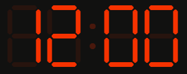
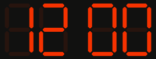
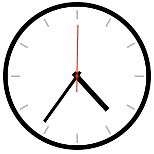
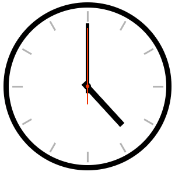
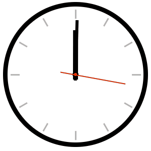

# Упражнение: Часы

## Задание

1. Откройте файл `moje-styly.css` и дополните его согласно следующим инструкциям. В этом упражнении не нужно редактировать никакие другие файлы.

### Цифровые часы

1. Создайте анимацию, которая будет мигать элементом `.digitalni__dvojtecka` (двоеточие).
   1. Используйте свойство `opacity`, которое имеет начальное значение `1`. Для того чтобы сделать элемент невидимым, установите значение `0`.
   1. Установите продолжительность анимации на одну секунду.
   1. Пусть анимация повторяется бесконечно.
   
   
1. Сделайте так, чтобы двоеточие мигало без плавного перехода (резко).
   

#### Примечание
Часы будут постоянно показывать 12:00, то есть `12:00` и `12 00`. Не беспокойтесь об этом. Для изменения цифр в соответствии с текущим временем потребовался бы JavaScript, который не является предметом этого упражнения.

### Аналоговые часы

1. Создайте анимацию, которая будет вращать секундную стрелку `.analogove__vterinova`.
   - Анимация не должна никогда заканчиваться. Пусть стрелка вращается постоянно.
   - Каждая секунда должна быть одинаковой длины. Обратите внимание, что анимации по умолчанию медленные в начале и в конце.
   - Для проверки ускорьте анимацию в 10 раз. Один оборот должен занимать 6 секунд.
   
   
1. Добавьте аналогичную анимацию для минутной стрелки `.analogove__minutova`.
   - Ускорьте и минутную, и секундную анимации в 100 раз по сравнению с реальным временем.
   
   
1. Добавьте вращение для часовой стрелки `.analogove__hodinova`.
   - Ускорьте все стрелки в 1000 раз.
   # Watch_HomeWork
